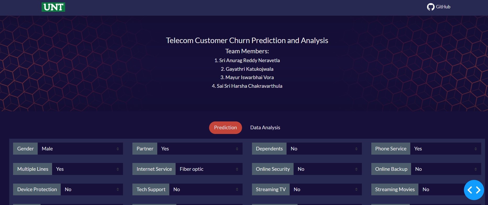
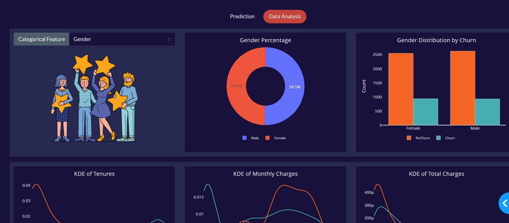

## Telecom Customer Churn Prediction
Live on Heroku:   

### Description
This dash application allows you to predict telco customer churn using machine learning algorithms (SVM, XGBoost).
You can:
- predict customer churn
- review data analysis

**Dataset:** 
https://www.kaggle.com/code/bandiatindra/telecom-churn-prediction/data?select=WA_Fn-UseC_-Telco-Customer-Churn.csv

### Installation and Usage
1. Install all dependencies listed in requirements.txt - all packages are pip-installable.
2. Run app.py to launch a local Dash server to host the Dash app. A link will appear in your console; click this to use the Dash app.

### Screenshots

